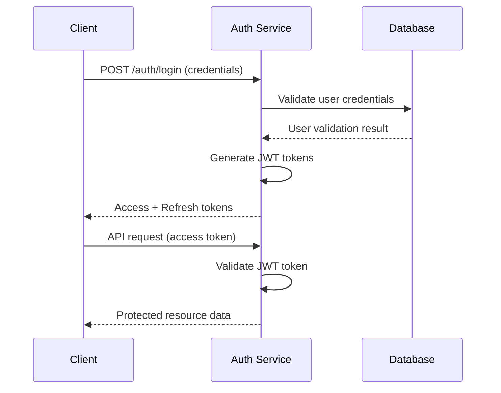

# Backend

Enterprise-grade NestJS backend for the restaurant ordering system. This production-ready API server provides comprehensive REST endpoints, real-time WebSocket communication, and robust authentication mechanisms to support the complete restaurant management platform.

---

## 🚀 Quick Start

```bash
npm install
cp .env.example .env
# Configure .env with your MongoDB URI and JWT secrets
npm run start:dev
```

The API server will be available at `http://localhost:4000/`

---

## 🏗️ Architecture Overview

### Modern NestJS Patterns
- **Modular Architecture** — Domain-driven module organization
- **Dependency Injection** — Clean, testable service architecture
- **Decorators & Metadata** — Declarative programming model
- **Type Safety** — Strong TypeScript typing throughout

### Architectural Principles
- **Domain-Oriented Modules** — Business logic organized by domain
- **Thin Controllers** — Controllers handle HTTP, services handle business logic
- **Centralized Policies** — Cross-cutting concerns in common modules
- **Explicit Validation** — DTOs for all input validation
- **Standardized Responses** — Consistent API response envelopes

---

## 🛠️ Technology Stack

### Core Framework
- **NestJS 11** — Progressive Node.js framework with TypeScript
- **Express Platform** — HTTP server foundation
- **Socket.IO** — Real-time WebSocket communication
- **Reflect Metadata** — Decorator and metadata support

### Database & ORM
- **MongoDB** — NoSQL document database
- **Mongoose** — Elegant MongoDB object modeling
- **TypeScript Integration** — Strong typing for database operations

### Authentication & Security
- **JWT (JSON Web Tokens)** — Stateless authentication
- **Passport.js** — Authentication middleware
- **bcryptjs** — Secure password hashing
- **Helmet** — Security header middleware
- **class-validator** — Input validation and sanitization

### API Documentation
- **Swagger/OpenAPI** — Interactive API documentation
- **@nestjs/swagger** — Automatic OpenAPI generation
- **TypeScript Decorators** — Rich API metadata

### Development Tools
- **Jest** — Testing framework with coverage
- **ESLint** — Code linting and consistency
- **Prettier** — Code formatting
- **TypeScript** — Type checking and compilation

---

## 📁 Detailed Structure

### High-Level Organization
```text
backend/
├── docs/                                 # Backend documentation
│   ├── README.md                         # Documentation index
│   ├── api.md                            # REST API documentation
│   ├── architecture.md                   # Architecture patterns
│   ├── auth.md                           # Authentication & authorization
│   ├── database.md                       # Database schema and design
│   ├── dependencies.md                   # Package dependencies and usage
│   ├── operations.md                     # Deployment and operations
│   ├── setup.md                          # Development environment setup
│   ├── seed.md                           # Database seeding and migrations
│   └── websocket.md                      # Real-time events documentation
├── src/                                  # Application source code
│   ├── common/                           # Cross-cutting concerns
│   ├── modules/                          # Business domain modules
│   ├── config/                           # Configuration management
│   ├── app.module.ts                     # Root application module
│   ├── main.ts                           # Application bootstrap
│   └── test/                             # Test utilities and helpers
├── test/                                 # End-to-end tests
├── .env.example                          # Environment configuration template
├── nest-cli.json                         # NestJS CLI configuration
├── tsconfig.json                         # TypeScript configuration
├── package.json                          # Dependencies and scripts
└── README.md                             # This file
```

### Source Code Organization (`src/`)
```text
src/
├── common/                               # Shared infrastructure
│   ├── decorators/                       # Custom decorators
│   ├── filters/                          # Exception filters
│   ├── guards/                           # Authentication and authorization guards
│   ├── interceptors/                     # Request/response interceptors
│   ├── middlewares/                      # Custom middleware
│   ├── pipes/                            # Data transformation pipes
│   └── utils/                            # Utility functions
├── modules/                              # Business domain modules
│   ├── auth/                            # Authentication module
│   ├── users/                           # User management
│   ├── tables/                          # Table management
│   ├── orders/                          # Order processing
│   ├── menu/                            # Menu and items
│   ├── categories/                      # Menu categories
│   ├── store/                           # Store configuration
│   ├── messages/                        # Messaging system
│   ├── reports/                         # Analytics and reports
│   └── websocket/                       # Real-time events
├── config/                              # Configuration management
│   ├── database.config.ts               # Database configuration
│   ├── jwt.config.ts                    # JWT configuration
│   └── swagger.config.ts               # API documentation config
├── app.module.ts                        # Root module
└── main.ts                              # Application entry point
```

### Module Pattern
Each domain module follows a consistent organization:

```text
module-name/
├── module-name.module.ts        # Module definition
├── module-name.controller.ts    # HTTP request handlers
├── module-name.service.ts       # Business logic and data operations
├── module-name.repository.ts    # Database operations (if needed)
├── module-name.dto.ts           # Data transfer objects
├── module-name.entity.ts        # Database entity/schema
├── module-name.gateway.ts       # WebSocket gateway (if needed)
├── module-name.spec.ts          # Unit tests
└── module-name.e2e-spec.ts      # End-to-end tests
```

---

## 🔌 Service Endpoints

### API Base URL
```
Development: http://localhost:4000/api
Production:  https://api.yourdomain.com/api
```

### Core Endpoints

#### Authentication
```bash
POST   /api/auth/login          # User authentication
POST   /api/auth/register       # User registration
POST   /api/auth/refresh        # Token refresh
POST   /api/auth/logout         # User logout
```

#### User Management
```bash
GET    /api/users               # List users (admin)
GET    /api/users/:id           # Get user details
PUT    /api/users/:id           # Update user
DELETE /api/users/:id           # Delete user
```

#### Table Management
```bash
GET    /api/tables              # List tables
POST   /api/tables              # Create table
GET    /api/tables/:id          # Get table details
PUT    /api/tables/:id          # Update table
DELETE /api/tables/:id          # Delete table
POST   /api/tables/:id/qr      # Generate QR code
```

#### Order Management
```bash
GET    /api/orders              # List orders
POST   /api/orders              # Create order
GET    /api/orders/:id          # Get order details
PUT    /api/orders/:id          # Update order status
DELETE /api/orders/:id          # Cancel order
GET    /api/orders/table/:tableId # Orders by table
```

#### Menu Management
```bash
GET    /api/menu                # Get full menu
GET    /api/menu/categories     # Get categories
GET    /api/menu/items          # Get menu items
POST   /api/menu/items          # Create menu item
PUT    /api/menu/items/:id      # Update menu item
DELETE /api/menu/items/:id      # Delete menu item
```

### API Documentation
- **Interactive Swagger UI**: `http://localhost:4000/api/docs`
- **OpenAPI JSON**: `http://localhost:4000/api/docs-json`
- **Postman Collection**: Available via Swagger export

---

## 🔐 Authentication & Security

### JWT-Based Authentication
- **Access Tokens**: Short-lived (15 minutes) JWT tokens
- **Refresh Tokens**: Long-lived (7 days) refresh tokens
- **Token Rotation**: Automatic refresh token rotation
- **Secure Storage**: HttpOnly cookies for refresh tokens

### Role-Based Access Control (RBAC)
```typescript
enum UserRole {
  ADMIN = 'admin',           # Full system access
  MANAGER = 'manager',       # Restaurant management
  STAFF = 'staff',          # Basic operations
  CUSTOMER = 'customer'     # Customer access (future)
}
```

### Security Measures
- **Password Hashing**: bcryptjs with salt rounds
- **Input Validation**: Comprehensive DTO validation
- **Rate Limiting**: Request throttling per endpoint
- **CORS Configuration**: Secure cross-origin requests
- **Security Headers**: Helmet middleware for security headers
- **SQL Injection Prevention**: Mongoose ODM protection

### Authentication Flow


---

## 🔄 Real-Time Communication

### WebSocket Events
The backend provides real-time updates through Socket.IO:

#### Connection Events
```typescript
// Client connection
socket.emit('join-room', { tableId: 'table-123' });

// Server responses
socket.on('order-updated', (order) => { /* handle */ });
socket.on('table-status-changed', (table) => { /* handle */ });
```

#### Event Types
- **Order Events**: Order creation, status updates, completion
- **Table Events**: Table status changes, QR code updates
- **System Events**: Maintenance notifications, system alerts
- **Message Events**: Staff communications, announcements

### WebSocket Namespaces
```typescript
// Main events namespace
/io/events

// Table-specific namespace
/io/table/:tableId

// Admin namespace
/io/admin
```

---

## 🗄️ Database Design

### MongoDB Collections
```typescript
// Users Collection
interface User {
  _id: ObjectId;
  email: string;
  password: string; // bcrypt hash
  role: UserRole;
  profile: UserProfile;
  createdAt: Date;
  updatedAt: Date;
}

// Tables Collection
interface Table {
  _id: ObjectId;
  number: string;
  capacity: number;
  status: TableStatus;
  qrCode: string;
  location?: string;
  createdAt: Date;
  updatedAt: Date;
}

// Orders Collection
interface Order {
  _id: ObjectId;
  tableId: ObjectId;
  items: OrderItem[];
  status: OrderStatus;
  totalAmount: number;
  createdAt: Date;
  updatedAt: Date;
}

// Menu Items Collection
interface MenuItem {
  _id: ObjectId;
  name: string;
  description: string;
  price: number;
  category: ObjectId;
  available: boolean;
  images: string[];
  createdAt: Date;
  updatedAt: Date;
}
```

### Database Indexes
```typescript
// Performance indexes
db.users.createIndex({ email: 1 }, { unique: true });
db.orders.createIndex({ tableId: 1, status: 1 });
db.menuItems.createIndex({ category: 1, available: 1 });
db.orders.createIndex({ createdAt: -1 });
```

---

## 🧪 Testing Strategy

### Unit Testing
- **Service Tests**: Business logic and data operations
- **Controller Tests**: HTTP request handling
- **Repository Tests**: Database operations
- **Utility Tests**: Pure function testing

### Integration Testing
- **API Endpoints**: Full request/response cycles
- **Database Operations**: Real database interactions
- **Authentication Flows**: Complete auth workflows
- **WebSocket Events**: Real-time communication testing

### Test Organization
```text
src/modules/module-name/
├── module-name.service.spec.ts     # Service unit tests
├── module-name.controller.spec.ts  # Controller tests
├── module-name.e2e-spec.ts         # Integration tests
└── __mocks__/                      # Test fixtures and mocks
```

### Running Tests
```bash
# Run all tests
npm test

# Run tests with coverage
npm run test:cov

# Run end-to-end tests
npm run test:e2e

# Watch mode for development
npm run test:watch
```

---

## 🔧 Development Workflow

### Local Development
```bash
# Install dependencies
npm install

# Start development server with hot reload
npm run start:dev

# Start with debugging
npm run start:debug

# Build for production
npm run build

# Start production build
npm run start:prod
```

### Code Quality
```bash
# Lint and auto-fix
npm run lint

# Format code with Prettier
npm run format

# Type checking
npm run type-check

# Run all quality checks
npm run check
```

### Database Management
```bash
# Seed database with sample data
npm run seed

# Reset database (development only)
npm run db:reset

# Create database migration
npm run migration:create

# Run migrations
npm run migration:run
```

---

## 🚀 Deployment & Production

### Environment Configuration
```bash
# Production environment variables
NODE_ENV=production
PORT=4000
MONGO_URI=mongodb://localhost:27017/restaurant-prod
JWT_ACCESS_SECRET=your-access-secret
JWT_REFRESH_SECRET=your-refresh-secret
CORS_ORIGIN=https://yourdomain.com
```

### Docker Deployment
```dockerfile
# Dockerfile example
FROM node:18-alpine
WORKDIR /app
COPY package*.json ./
RUN npm ci --only=production
COPY dist/ ./dist/
EXPOSE 4000
CMD ["node", "dist/main"]
```

### Production Considerations
- **Process Management**: PM2 for process management
- **Load Balancing**: Multiple instances behind load balancer
- **Database Replication**: MongoDB replica sets
- **Monitoring**: Application performance monitoring
- **Logging**: Structured logging with log levels
- **Security**: HTTPS, firewalls, and network security

---

## 📊 Performance & Monitoring

### Performance Optimization
- **Database Indexing**: Strategic index placement
- **Connection Pooling**: MongoDB connection optimization
- **Caching Strategy**: Redis for frequently accessed data
- **Response Compression**: Gzip compression for API responses
- **Query Optimization**: Efficient database queries

### Monitoring & Observability
```typescript
// Health check endpoint
GET /api/health

// Metrics endpoint
GET /api/metrics

// Application logs
{
  timestamp: '2024-01-01T00:00:00.000Z',
  level: 'info',
  message: 'Order created successfully',
  orderId: '507f1f77bcf86cd799439011',
  userId: '507f1f77bcf86cd799439012'
}
```

### Error Handling
- **Global Exception Filter**: Centralized error handling
- **Structured Error Responses**: Consistent error format
- **Error Logging**: Comprehensive error tracking
- **Graceful Degradation**: Fallback behaviors for failures

---

## 🔌 API Integration Examples

### Frontend Integration
```typescript
// Angular service example
@Injectable()
export class OrderService {
  constructor(private http: HttpClient) {}

  createOrder(orderData: CreateOrderDto): Observable<Order> {
    return this.http.post<Order>('/api/orders', orderData);
  }

  getOrders(tableId: string): Observable<Order[]> {
    return this.http.get<Order[]>(`/api/orders/table/${tableId}`);
  }
}
```

### WebSocket Integration
```typescript
// WebSocket client setup
import { io } from 'socket.io-client';

const socket = io('http://localhost:4000', {
  auth: {
    token: 'your-jwt-token'
  }
});

socket.on('order-updated', (order) => {
  console.log('Order updated:', order);
});
```

---

## 📚 Related Documentation

### Backend Documentation
- [**API Documentation**](./docs/api.md) — Complete REST API reference
- [**Authentication**](./docs/auth.md) — Security and authorization details
- [**Database Schema**](./docs/database.md) — Data models and relationships
- [**WebSocket Events**](./docs/websocket.md) — Real-time event specifications
- [**Setup Guide**](./docs/setup.md) — Development environment setup
- [**Dependencies**](./docs/dependencies.md) — Package dependencies and usage
- [**Operations**](./docs/operations.md) — Deployment and maintenance

### System Documentation
- [**System Architecture**](../docs/README.md) — High-level system design
- [**Color System**](../docs/color-system.md) — Design tokens and theming
- [**i18n Conventions**](../docs/architecture/i18n-naming.md) — Translation standards

### Frontend Documentation
- [**Frontend Architecture**](../frontend/README.md) — Angular client architecture
- [**Frontend Setup**](../frontend/docs/setup.md) — Frontend development setup

---

## 🤝 Contributing to Backend

### Development Guidelines
1. **Follow NestJS Patterns** — Use decorators, modules, and dependency injection
2. **Type Safety** — Maintain strong TypeScript typing
3. **API Design** — Follow REST principles and OpenAPI standards
4. **Security First** — Consider security implications in all changes
5. **Test Coverage** — Maintain comprehensive test coverage

### Code Review Checklist
- [ ] TypeScript types are comprehensive and strict
- [ ] DTOs validate all input data
- [ ] Error handling is implemented
- [ ] Database operations are efficient
- [ ] Security measures are in place
- [ ] Tests cover critical functionality
- [ ] API documentation is updated
- [ ] WebSocket events are properly documented

### Pull Request Process
1. **Feature Branches** — Create branches for new features
2. **Testing** — Ensure all tests pass
3. **Documentation** — Update relevant documentation
4. **API Changes** — Update Swagger/OpenAPI documentation
5. **Review** — Submit for code review

---

## 🔍 Troubleshooting

### Common Issues

#### Database Connection
```bash
# Check MongoDB connection
npm run db:test

# Reset database (development)
npm run db:reset
```

#### Authentication Issues
```bash
# Generate new JWT secrets
node -e "console.log(require('crypto').randomBytes(64).toString('hex'))"
```

#### Performance Issues
```bash
# Check database indexes
npm run db:indexes

# Monitor query performance
npm run db:profile
```

### Debug Mode
```bash
# Start with debugging
npm run start:debug

# Enable verbose logging
DEBUG=app:* npm run start:dev
```

---

## 📈 Scaling & Architecture Evolution

### Horizontal Scaling
- **Stateless Design** — Services designed for horizontal scaling
- **Load Balancing** — Multiple instances behind load balancer
- **Database Sharding** — MongoDB sharding for large datasets
- **Caching Layer** — Redis for distributed caching

### Microservices Migration Path
- **Module Boundaries** — Clear module separation for future extraction
- **API Gateway** — Ready for API gateway implementation
- **Service Communication** — Prepared for inter-service communication
- **Data Consistency** — Eventual consistency patterns ready

---

*Last updated: [Current Date]*  
*NestJS Version: 11.x*  
*Node.js Requirement: v18+*  
*MongoDB Requirement: v5.0+*
