# Page Function Description

**English** | [繁體中文](./page-function-description.zh-TW.md)

This document provides a brief introduction to the functionality of each page.

---

## Theme Toggle Button

The theme toggle button in the top right corner allows switching between light and dark modes.

    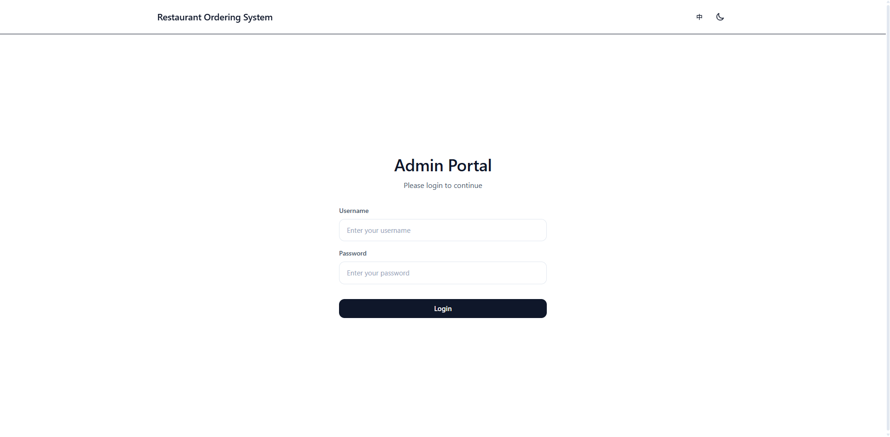
     
    Dark mode is the default. Click to switch to light mode.

---

## Dashboard - Login Page

    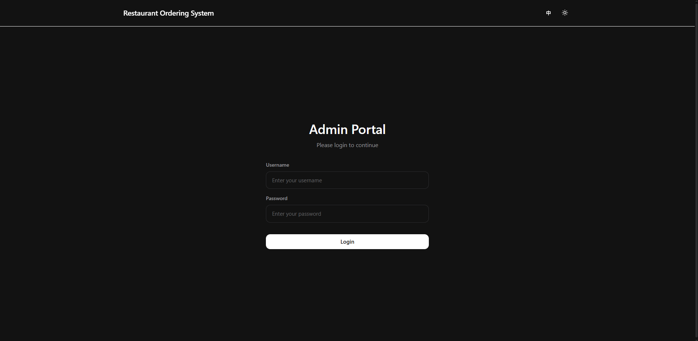
     
    Enter your username and password to log in to the admin dashboard.

---

## Dashboard - Table Management Page

    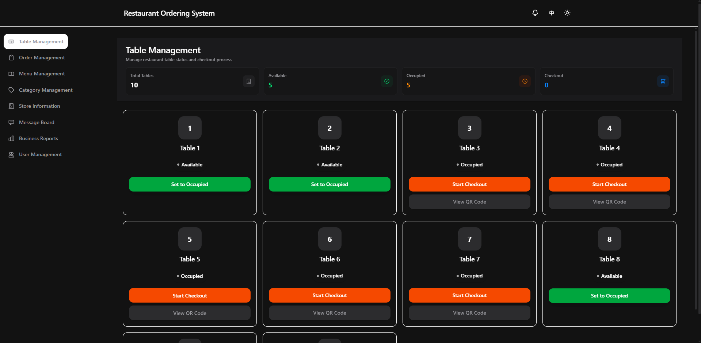
     
    Manage the status of each table.

---

## Dashboard - Order Management Page

    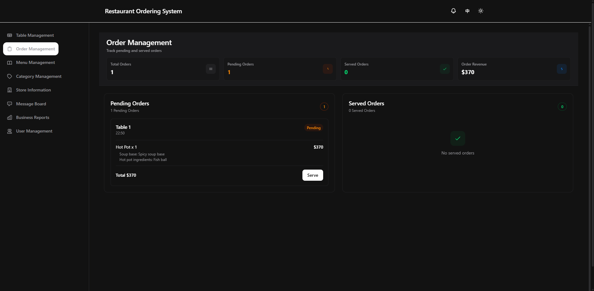
     
    Manage orders for each table.

---

## Dashboard - Menu Management Page

    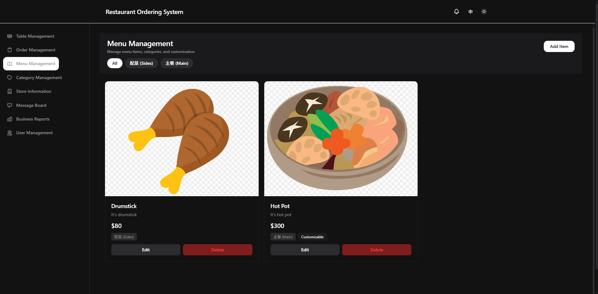
     
    Add, edit, and delete menu items.

---

## Dashboard - Category Management Page

    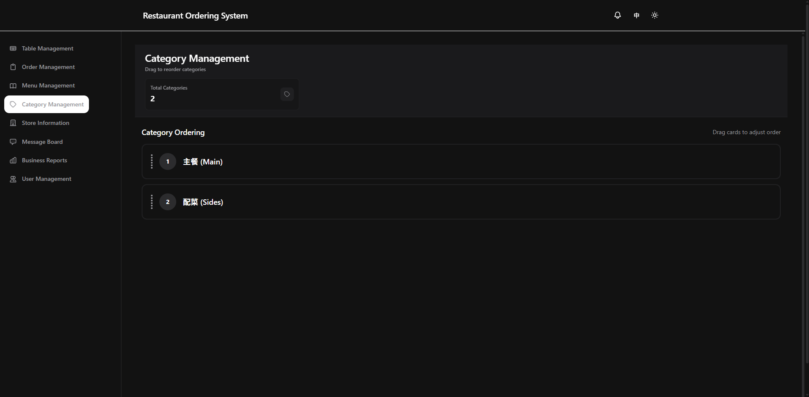
     
    Categorize menu items and customize category ordering.

---

## Dashboard - Store Information Page

    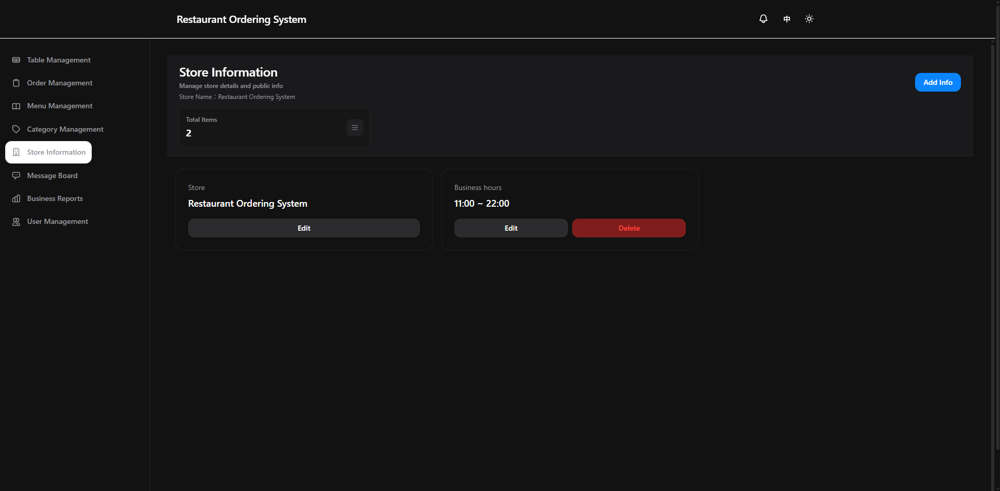
     
    Manage store information displayed on the ordering page.

---

## Dashboard - Message Board Page

    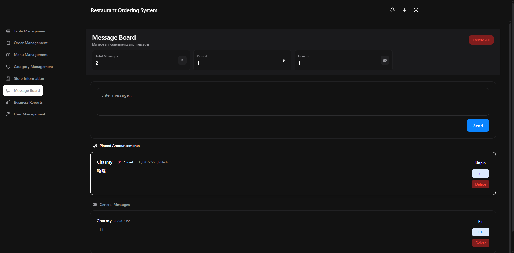
     
    Message board for communication between accounts.

---

## Dashboard - Business Reports Page

    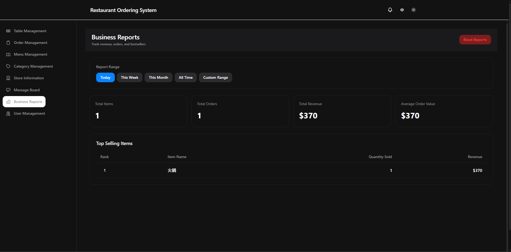
     
    View order quantities and amounts by time period. Only accessible to super admins and admins.

---

## Dashboard - User Management Page

    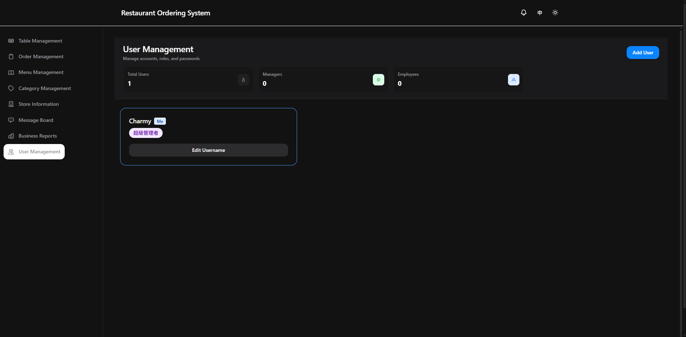
     
    Change user passwords. Only super admins and admins can add new users.

---

## Dashboard - Service Calls Button

    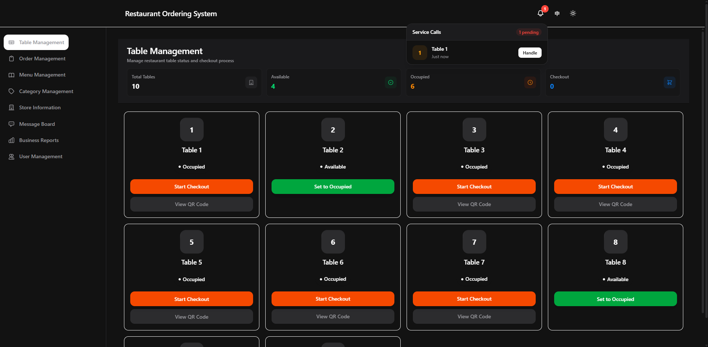
     
    View which table numbers require service.

---

## Ordering Page - Menu Page

    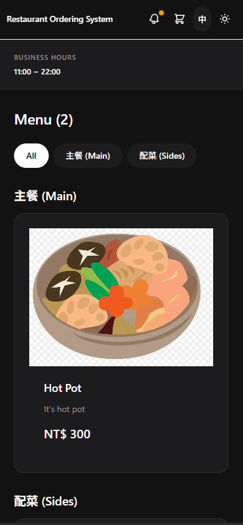
     
    Browse and order from the menu.

---

## Ordering Page - Meal Selection Pop-up

    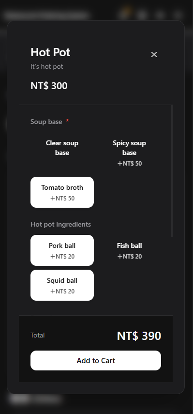
     
    Select meal options and details.

---

## Ordering Page - Cart Page

    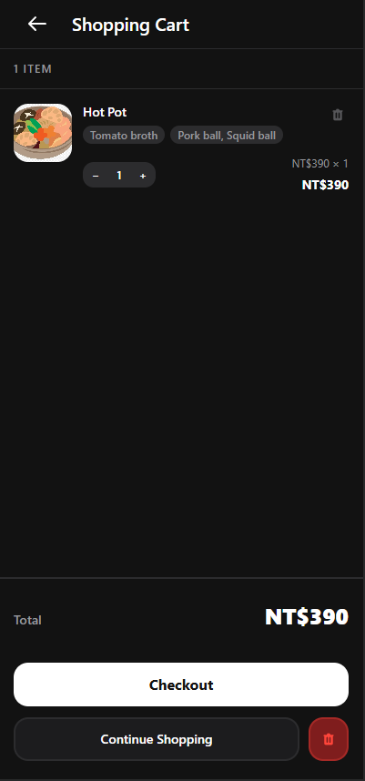
     
    Review items in your cart before submitting.

---

## Ordering Page - Confirm Page

    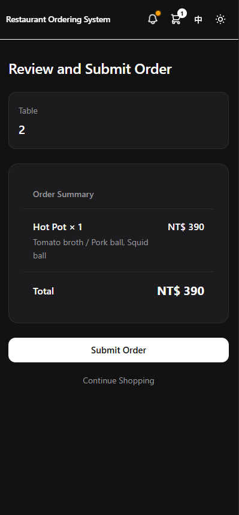
     
    Confirm your order before submission.

---

## Ordering Page - Result Page

    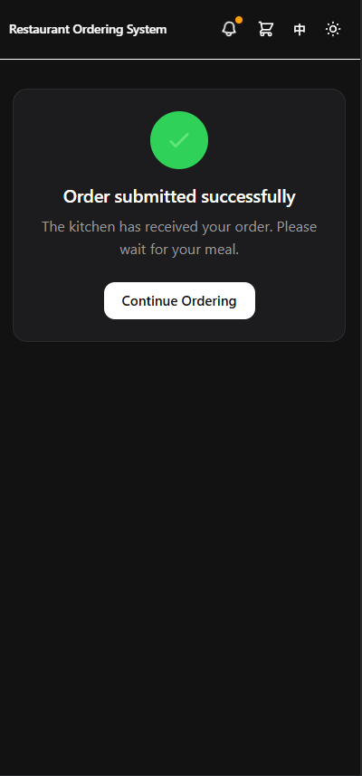
     
    Display order submission result.

