# 頁面功能說明

[English](./page-function-description.md) | **繁體中文**

本文件簡單介紹各頁面功能

---

## 右上角主題按鈕

右上角的主題按鈕可以切換亮色、暗色。

    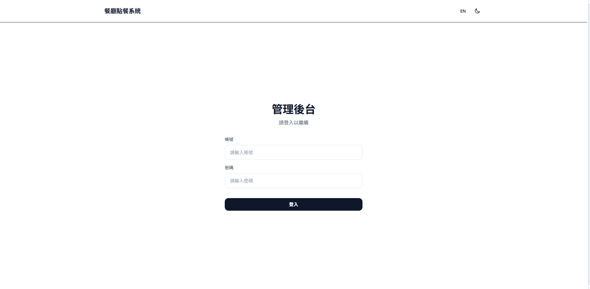
     
    預設為暗色，點擊後可以切換成亮色。

---

## 管理後台 - 登入頁面

    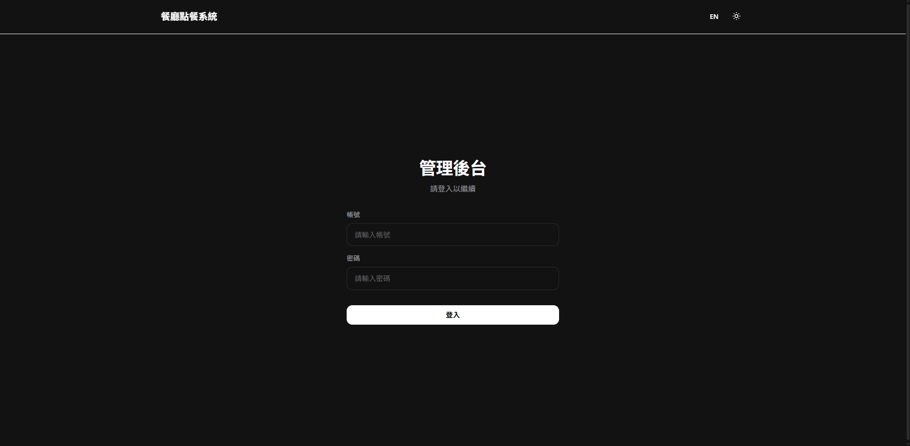
     
    登入管理後台前需先輸入帳號以及密碼。

---

## 管理後台 - 桌位管理頁面

    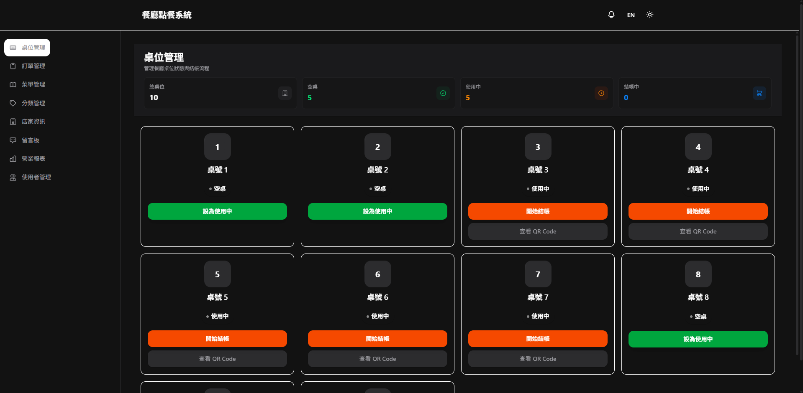
     
    管理各桌使用狀況。

---

## 管理後台 - 訂單管理頁面

    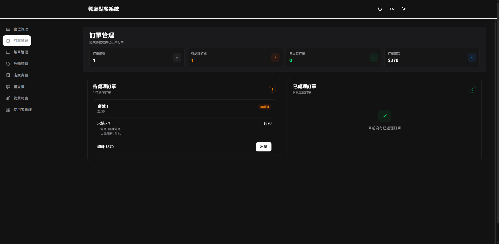
     
    管理各桌訂單。

---

## 管理後台 - 菜單管理頁面

    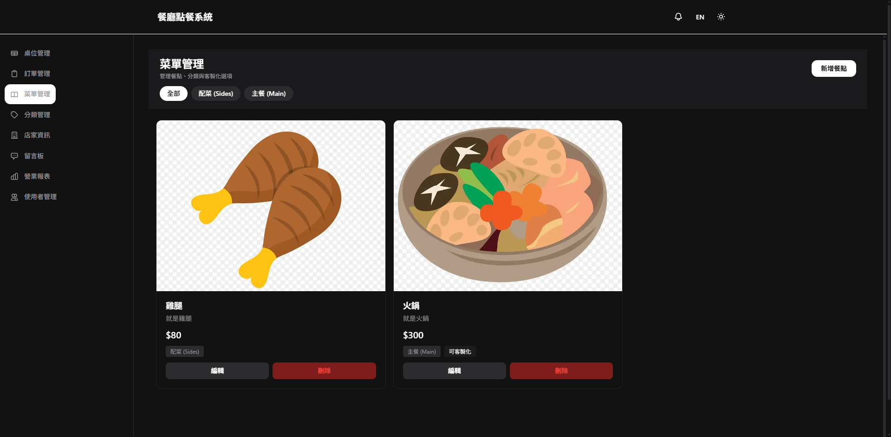
     
    可以在此新增、修改以及刪除菜單。

---

## 管理後台 - 分類管理頁面

    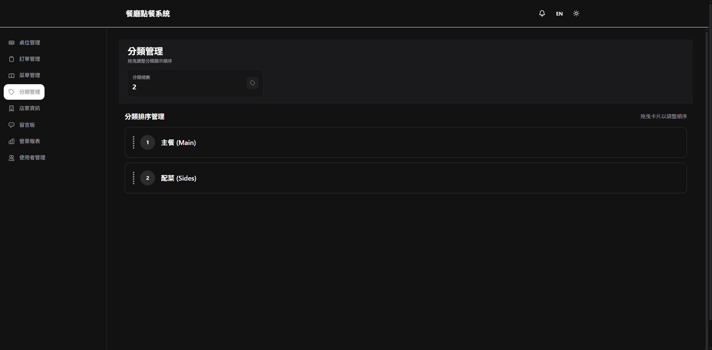
     
    菜單可以進行分類，此頁面則可以自訂分類排序。

---

## 管理後台 - 店家資訊管理頁面

    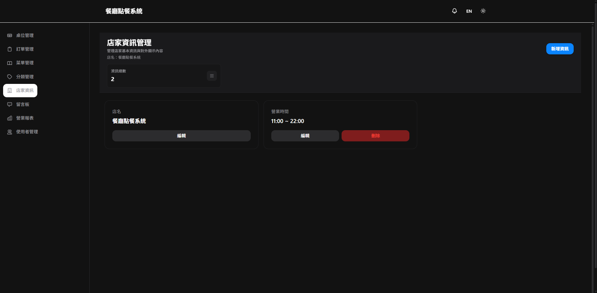
     
    管理店家資訊，相對應顯示於點餐頁面。

---

## 管理後台 - 留言板頁面

    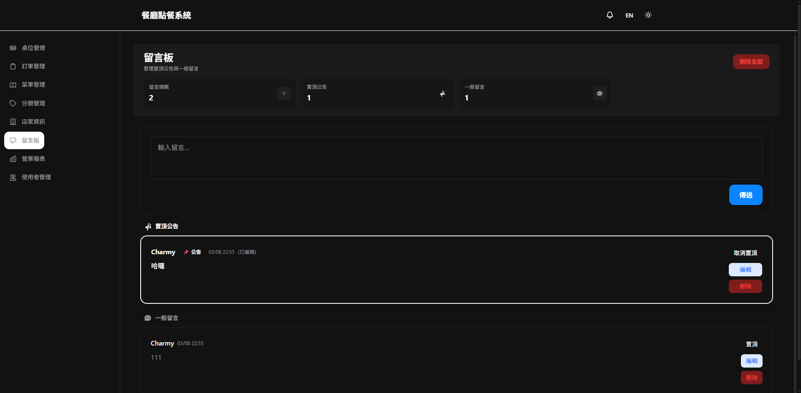
     
    提供留言板供各帳號間進行溝通。

---

## 管理後台 - 營業報表頁面

    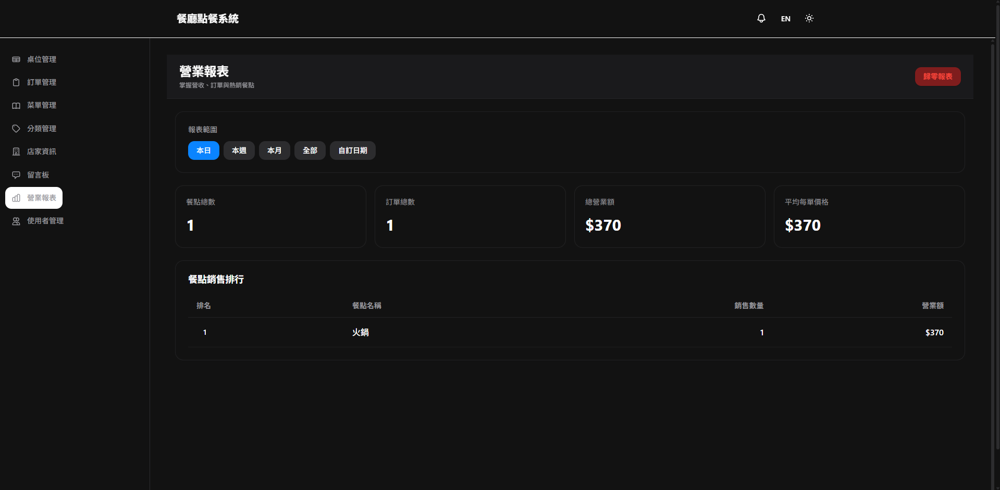
     
    提供各時間區間點餐數量與金額，只有超級管理者與管理者有查看權限。

---

## 管理後台 - 使用者管理頁面

    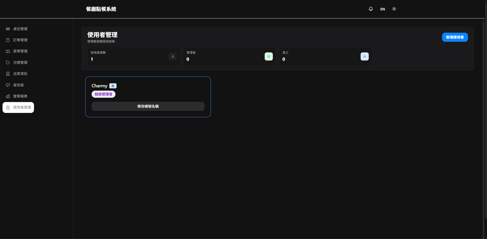
     
    提供使用者進行密碼修改，只有超級管理者與管理者可以新增使用者。

---

## 管理後台 - 服務鈴按鈕

    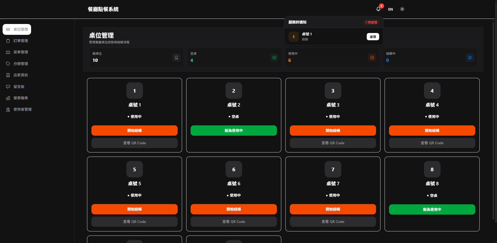
     
    可以得知哪個桌號需要服務。

---

## 點餐頁面 - 菜單頁面

    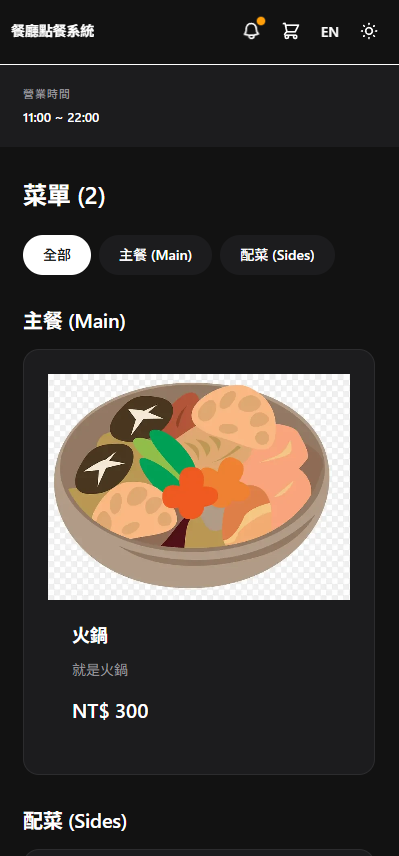
     
    點餐頁面進行點餐。

---

## 點餐頁面 - 餐點選擇彈窗

    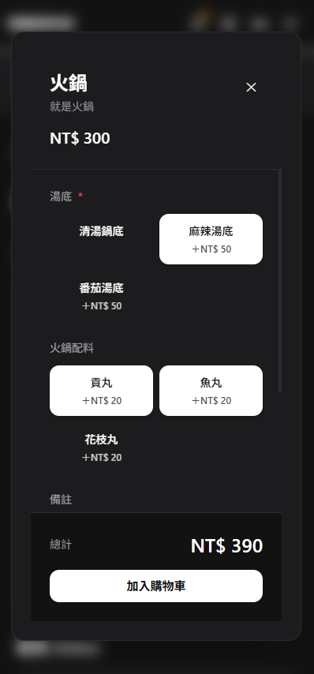
     
    選擇餐點細項。

---

## 點餐頁面 - 購物車頁面

    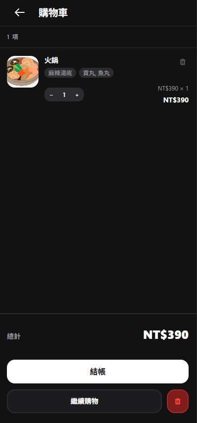
     
    查看要送單的餐點有哪些。

---

## 點餐頁面 - 確認餐點頁面

    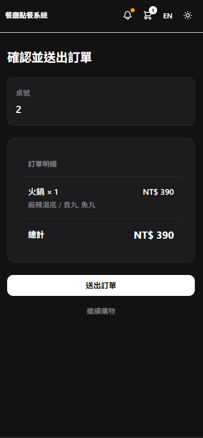
     
    確認要送單的餐點有哪些。

---

## 點餐頁面 - 確認送單頁面

    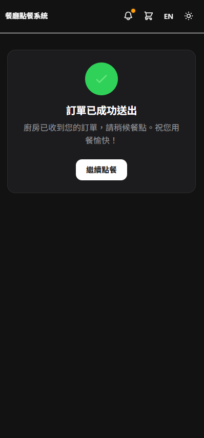
     
    顯示是否成功送單。

